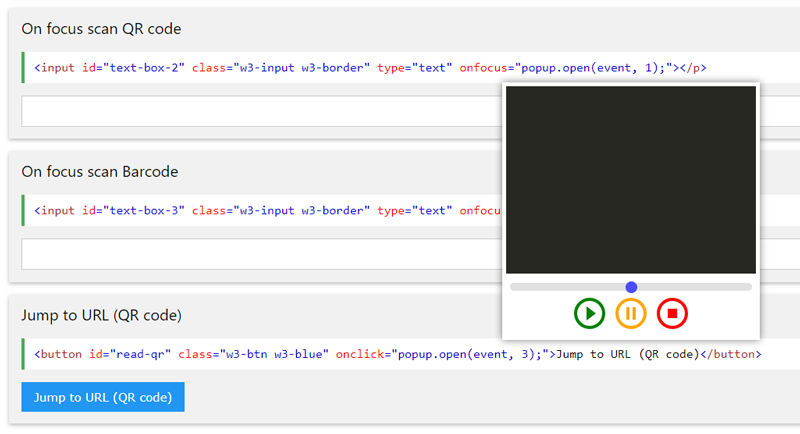

DecoderPopup 
==========================

Helper Popup for WebCodeCamJS 

	- easy configuration and usage
	- if there have more cameras, selector will appears
	- zoom and selected camera will be saved to cookie
	- movable viewfinder

Add missing files from WebCodeCamJS repository
----

Download [WebCodeCamJS Link1] or [WebCodeCamJS Link2] 

	- Copy webcodecamjs/audio folder to DecoderPopup/
	- Copy webcodecamjs/js/webcodecamjs.js javascript file to DecoderPopup/js/
	- Copy webcodecamjs/js/qrcodelib.js javascript file to DecoderPopup/js/
	- Copy webcodecamjs/js/DecoderWorker.js javascript file to DecoderPopup/js/

Version
----

1.0.0

[Homepage] - Homepage, examples

License
----

MIT

Author: Tóth András
---
http://atandrastoth.co.uk/

2017-11-29

[Homepage]:https://atandrastoth.co.uk/main/pages/plugins/decoderPopup/
[WebCodeCamJS Link1]:https://github.com/andrastoth/webcodecamjs
[WebCodeCamJS Link2]:https://www.jsclasses.org/package/446-JavaScript-Scan-barcodes-and-qrcodes-with-a-Webcam.html
